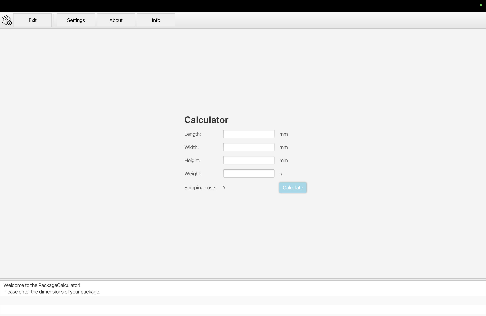

## Getting Started 👋

Welcome to the PackageCalculator project of the Advanced Software Engineering lecture in the 5. Semester. 📦  
In the following, the folder structure is explained, a brief guide to the program itself is given, the coverage and metrics are briefly explained and a few points that do not work are mentioned.
## Folder Structure 📂

The workspace contains of three important folders:

- [`docs`](docs): contains all JavaDoc files
- [`src`](src): contains the source code and dependency files and test code
- [`misc`](misc): contains all other files, such as metrics and test coverage

The [`src`](src)-folder contains following java packages:
- [`control`](src/control): all files and dependencies regarding the logic of the calculator
- [`data`](src/data): all data files
- [`gui`](src/gui): all files and dependencies regarding the GUI
- [`test`](src/test): all tests and its dependencies

## Manual 📝
To use this PackageCalculator you first need to start the executable/main, which is located in the [`src/gui/PackageCalculator.java`](src/gui/PackageCalculator.java)  

After starting, the PackageCalculator should open and should look something like the following:

In the **ToolbarArea** you can find different buttons:
- `Exit`: Close the application
- `Settings`: Settings-Window will pop up. More info and a TODO can be found in the source code.
- `About`: The project repo will be opened
- `Info`: opens a table of the available shipping costs, the version and all authors/contributors

In the **CalculatorArea** you can enter the dimensions of the package you want to calculate the shipping costs for.  
With the "Calculate"-Button the calculation will be executed.

In the **MessagesArea** there will be the last message displayed. This either will be a successful message if the calculation was a success or a error message if not, with an explanation what went wrong.

By hovering over not-understandable buttons or labels, a short description (tooltip) will pop up.

## Metrics 📊
The metrics were captured using [Sonar](https://www.sonarqube.org/) and the [SonarQube Extension](https://marketplace.visualstudio.com/items?itemName=SonarSource.sonarlint-vscode) in VSCode.  
All necessary screenshots can be found in the [`misc/metrics`](misc/metrics)-folder.

## Coverage 🛡️
The Coverage screenshots of the Glass-box-tests can be found in the [`misc/coverage`](misc/coverage)-folder.

## Things that didn't work out 💔
1. Add the `test`-package to JavaDoc, because of an error in VS Code.

2. The coverage in SonarQube is wrong/not available due to Sonar not detecting the tests as tests and so shows 0%.

3. I still got a warning after generating the JavaDoc, but these are all warnings related to comments of classes, because JavaDoc does not recognize my comments there.